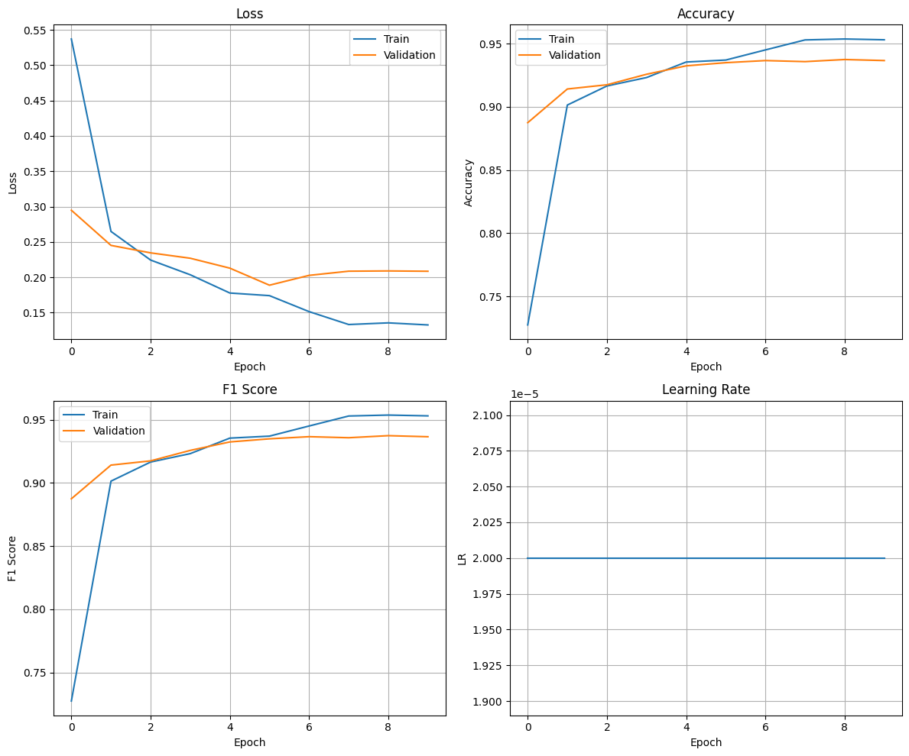
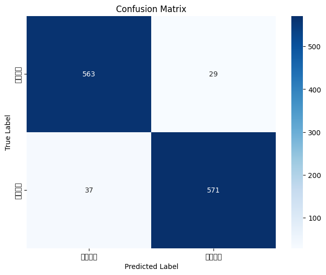

# zh-sentibert

> 阅读语言：[English](README.md) | **简体中文**

基于 **BERT-base-Chinese** 在 **ChnSentiCorp** 上微调的中文情感分类器：支持分层解冻、加权采样、同义词增强、混合精度训练，以及 warmup + 线性衰减的学习率调度。

[](LICENSE)
[](https://www.python.org/)
[](https://pytorch.org/)
[](https://huggingface.co/docs/transformers)

## ✨ 项目特色

- 🇨🇳 **中文二分类情感识别**（正向 / 负向），数据集为 `lansinuote/ChnSentiCorp`（9600 / 1200 / 1200）。
- 🧊 **分层冻结策略**：BERT 仅解冻最后 `N` 层 + pooler，分类头使用 `Linear → ReLU → Linear` 并 Xavier 初始化。
- ⚖️ **类别不平衡处理**：基于类别频率倒数的 `WeightedRandomSampler`。
- 🔤 **轻量级文本增强**：基于 jieba 的同义词替换，`augment_prob=0.1`。
- ⚡ **混合精度训练**：`torch.amp.GradScaler` + 梯度裁剪（`max_norm=1.0`）。
- 📉 **学习率调度**：`get_linear_schedule_with_warmup`，按 `WARMUP_RATIO` 计算预热步数。
- 🛑 **早停机制**：以验证 accuracy 为指标，patience = 5。
- 📊 **自动产出**：accuracy / precision / recall / F1 / AUC、混淆矩阵、训练曲线图。
- 🔮 **推理工具箱**：批量 / 文件 / 交互式预测，蒙特卡洛 dropout 不确定性分析，注意力可解释性。

## 🚀 快速开始

### 1. 安装依赖

```bash
git clone https://github.com/Zsyyxrs/zh-sentibert.git
cd zh-sentibert

python -m venv .venv && source .venv/bin/activate   # Windows: .venv\Scripts\activate
pip install -r requirements.txt
# 或以可编辑方式安装：
pip install -e .
```

### 2. 训练

```bash
python scripts/train.py --epochs 10 --batch_size 32 --lr 2e-5
```

最佳模型会保存到 `checkpoints/best_model_epoch_*.pth`，指标、训练曲线与混淆矩阵会输出到 `results/`。

### 3. 评估

```bash
python scripts/train.py --mode eval --checkpoint checkpoints/best_model_epoch_X.pth
```

### 4. 推理

```bash
# 单条文本
python scripts/train.py --mode predict --input_text "这家店的氛围真的绝绝子"

# 批量预测（每行一条）
python scripts/train.py --mode predict --input_file examples/sample_texts.txt

# 交互式 REPL
python scripts/train.py --mode predict
```

### 5. 作为库调用

```python
from transformers import AutoTokenizer
from zh_sentibert import Config, SentimentPredictor

tokenizer = AutoTokenizer.from_pretrained(Config.MODEL_PATH)
predictor = SentimentPredictor(
    model_path="checkpoints/best_model_epoch_5.pth",
    tokenizer=tokenizer,
    config=Config,
)
print(predictor.predict("电影剧情还可以，就是节奏有点慢。", return_probs=True))
```

## 🏗 架构

```
                ┌──────────────────────────┐
   原始文本 ──▶ │  DataProcessor.clean()   │  去 HTML / URL / 特殊字符
                └────────────┬─────────────┘
                             ▼
                ┌──────────────────────────┐
                │  ImprovedDataset         │  分词 + 同义词增强（jieba）
                │  WeightedRandomSampler   │  类别再平衡
                └────────────┬─────────────┘
                             ▼
   ┌──────────────────────────────────────────────────┐
   │  bert-base-chinese (12L · 12H · 768d · 110M)     │
   │  ── 仅解冻最后 N 层 + pooler ──                  │
   └────────────┬─────────────────────────────────────┘
                ▼
   [CLS] 池化 ──▶ Dropout ──▶ Linear(768→768) ──▶ ReLU
                                                    │
                            Dropout ◀───────────────┘
                                │
                                ▼
                     Linear(768 → 2)  →  softmax  →  {负向, 正向}

   训练：AdamW · 交叉熵 · warmup+线性衰减 · AMP · 梯度裁剪 · 早停
```

目录结构：

```
zh-sentibert/
├── src/zh_sentibert/        # 可被 import 的核心包
│   ├── config.py            # 超参与路径配置
│   ├── data_utils.py        # 数据集 / 采样器 / 增强 / 清洗
│   ├── model.py             # ImprovedModel / MultiTask / Attention 变体
│   ├── trainer.py           # 训练/验证/测试循环、指标、绘图
│   └── inference.py         # SentimentPredictor 与交互式 REPL
├── scripts/
│   ├── train.py             # CLI 入口（train / eval / predict）
│   └── download_dataset.py  # 从 HuggingFace 缓存 ChnSentiCorp
├── examples/
│   └── sample_texts.txt     # 示例输入
├── docs/images/             # 架构图与结果截图
├── results/                 # 自动生成的指标、曲线、混淆矩阵
├── logs/                    # 训练日志与历史 JSON
├── pyproject.toml
├── requirements.txt
└── LICENSE
```

## 🛠 技术栈

| 层级       | 工具                                                           |
| ---------- | -------------------------------------------------------------- |
| 基座模型   | `google-bert/bert-base-chinese`（12 层，768 维，1.1 亿参数） |
| 框架       | PyTorch ≥ 2.0 · Hugging Face `transformers` ≥ 4.30        |
| 数据       | `datasets`（`lansinuote/ChnSentiCorp`）                    |
| 中文分词   | `jieba`（仅用于同义词增强）                                  |
| 指标与绘图 | `scikit-learn` · `matplotlib` · `seaborn`              |
| 优化       | AdamW ·`get_linear_schedule_with_warmup` · `torch.amp`   |
| 实验记录   | `tqdm` + `logging`；可选 `wandb`                         |

## 📊 实验结果

测试集（1200 条，ChnSentiCorp 原始 test split），V100 单卡，默认超参：

| 指标      | 数值             |
| --------- | ---------------- |
| Accuracy  | **0.9450** |
| Precision | 0.9451           |
| Recall    | 0.9450           |
| F1        | 0.9450           |
| AUC       | **0.9827** |

<details><summary>分类报告</summary>

```
              precision    recall  f1-score   support
   负向评价     0.9383    0.9510    0.9446       592
   正向评价     0.9517    0.9391    0.9454       608
   accuracy                         0.9450      1200
   macro avg     0.9450    0.9451    0.9450      1200
weighted avg     0.9451    0.9450    0.9450      1200
```

</details>

| 训练曲线                                   | 混淆矩阵                                    |
| ------------------------------------------ | ------------------------------------------- |
|  |  |

## 🧪 常见问题

| 现象                                                              | 原因                                              | 解决方案                                                                                                       |
| ----------------------------------------------------------------- | ------------------------------------------------- | -------------------------------------------------------------------------------------------------------------- |
| `Too Many Requests for url: https://hf-mirror.com/api/datasets` | `load_dataset` 每次都联网做校验，被 HF 镜像限流 | `export HF_HUB_OFFLINE=1`，并传入 `download_mode="reuse_dataset_if_exists", verification_mode="no_checks"` |
| CUDA OOM                                                          | batch 过大                                        | 减小 `--batch_size`，或在推理时设置 `Config.USE_FP16 = True`                                               |

## 🤝 贡献

欢迎提 Issue / PR。提交前请运行 `ruff`；新增功能请附简单的测试或示例。许可详见 [LICENSE](LICENSE)。

## 📄 许可证

[MIT](LICENSE) © Shangyi Zhu
